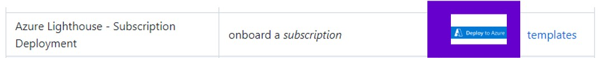
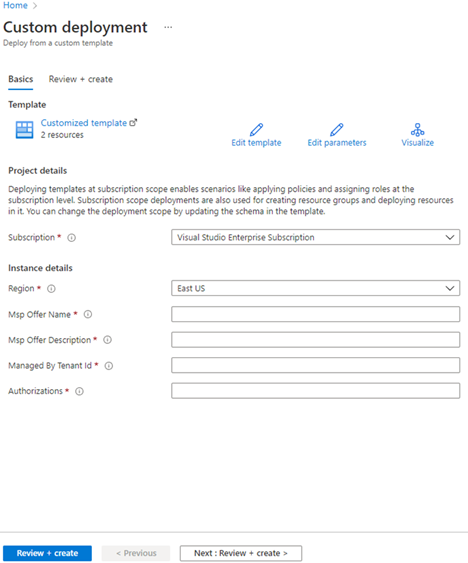

# Azure Lighthouse: Overview & Deployment
Azure Lighthouse is a multi-tenant management solution that enables Managed Service Providers (MSPs) and enterprises to manage multiple Azure tenants securely and efficiently. It allows cross-tenant access to subscriptions, resource groups, and services without requiring direct logins to each customer’s environment.

## Key Features of Azure Lighthouse
**1. Centralized Management** – Manage multiple Azure tenants from a single pane of glass.
**2. Granular Access Control** – Uses Azure RBAC to control permissions per tenant.
**3. Scalability** – Ideal for MSPs and enterprises managing multiple clients.
**4. Security & Compliance **– Provides just-in-time access and least privilege access control.
**5. Automation & Monitoring** – Uses Azure Monitor, Log Analytics, and Security Center across tenants.

## Benefits
1.  Manage multiple Azure tenants from a **single interface**.
2.  Enforce **role-based access control (RBAC)** for security.
3.  Improve **efficiency** by automating onboarding using **ARM Templates**.

## Azure Lighthouse Deployment Process to Client Tenant
### Step 1: Log Into the Clients tenant 
Goto Azure Portal and Login as Global Administrator and search for Azure Lighthouse and Click on Deploy to Azure for Azure Lighthouse – Subscription Deployment 





### Two ways to fill above instance details
#### 1st Method : Filling in all the detail fields using the information below copy and paste for each field

**Msp Offer Name:** 24/7 Eagle Eye Monitoring Service
 
**Msp Offer Description:** SOC offering as a service by Host Company Name. 24/7 Monitoring and Incident Response.

**Managed By Tenant Id:** 123e4567-e89b-12d3-a456-426614174000

**Authorization:** [{"principalId":"e9cac0fe-c600-4697-b2b3-4ac8ada1837d","principalIdDisplayName":"SOC_Tier_1","roleDefinitionId":"ab8e14d6-4a74-4a29-9ba8-549422addade"},{"principalId":"e9cac0fe-c600-4697-b2b3-4ac8ada1837d","principalIdDisplayName":"SOC_Tier_1","roleDefinitionId":"39bc4728-0917-49c7-9d2c-d95423bc2eb4"},{"principalId":"e9cac0fe-c600-4697-b2b3-4ac8ada1837d","principalIdDisplayName":"SOC_Tier_1","roleDefinitionId":"87a39d53-fc1b-424a-814c-f7e04687dc9e"},{"principalId":"e9cac0fe-c600-4697-b2b3-4ac8ada1837d","principalIdDisplayName":"SOC_Tier_1","roleDefinitionId":"43d0d8ad-25c7-4714-9337-8ba259a9fe05"},{"principalId":"e9cac0fe-c600-4697-b2b3-4ac8ada1837d","principalIdDisplayName":"SOC_Tier_1","roleDefinitionId":"b279062a-9be3-42a0-92ae-8b3cf002ec4d"},{"principalId":"88567632-e29b-4f12-8175-32975a4bb263","principalIdDisplayName":"SOC_Tier_2","roleDefinitionId":"87a39d53-fc1b-424a-814c-f7e04687dc9e"},{"principalId":"88567632-e29b-4f12-8175-32975a4bb263","principalIdDisplayName":"SOC_Tier_2","roleDefinitionId":"f4c81013-99ee-4d62-a7ee-b3f1f648599a"},{"principalId":"88567632-e29b-4f12-8175-32975a4bb263","principalIdDisplayName":"SOC_Tier_2","roleDefinitionId":"acdd72a7-3385-48ef-bd42-f606fba81ae7"},{"principalId":"88567632-e29b-4f12-8175-32975a4bb263","principalIdDisplayName":"SOC_Tier_2","roleDefinitionId":"749f88d5-cbae-40b8-bcfc-e573ddc772fa"},{"principalId":"88567632-e29b-4f12-8175-32975a4bb263","principalIdDisplayName":"SOC_Tier_2","roleDefinitionId":"e8ddcd69-c73f-4f9f-9844-4100522f16ad"},{"principalId":"38ede22e-a460-4b94-a6a4-66d168428ac0","principalIdDisplayName":"SOC_Tier_3","roleDefinitionId":"fb1c8493-542b-48eb-b624-b4c8fea62acd”}]
 
#### 2nd Method - Editing Parameters with Custom Deploment 
Replace the value loading a .JSON file or copy and paste the schema below:

``` json
{
  "$schema": "https://schema.management.azure.com/schemas/2019-04-01/deploymentParameters.json#",
  "contentVersion": "1.0.0.0",
  "parameters": {
    "mspOfferName": {
      "value": "24/7 Eagle Eye Monitoring Service"
    },
    "mspOfferDescription": {
      "value": "SOC offering as a service by Host Company Name. 24/7 Monitoring and Incident Response."
    },
    "managedByTenantId": {
      "value": "123e4567-e89b-12d3-a456-426614174000"
    },
    "authorizations": {
      "value": [
        {
          "principalId": "e9cac0fe-c600-4697-b2b3-4ac8ada1837d",
          "principalIdDisplayName": "SOC_Tier_1",
          "roleDefinitionId": "ab8e14d6-4a74-4a29-9ba8-549422addade"
        },
        {
          "principalId": "e9cac0fe-c600-4697-b2b3-4ac8ada1837d",
          "principalIdDisplayName": "SOC_Tier_1",
          "roleDefinitionId": "39bc4728-0917-49c7-9d2c-d95423bc2eb4"
        },
        {
          "principalId": "e9cac0fe-c600-4697-b2b3-4ac8ada1837d",
          "principalIdDisplayName": "SOC_Tier_1",
          "roleDefinitionId": "87a39d53-fc1b-424a-814c-f7e04687dc9e"
        },
        {
          "principalId": "88567632-e29b-4f12-8175-32975a4bb263",
          "principalIdDisplayName": "SOC_Tier_2",
          "roleDefinitionId": "87a39d53-fc1b-424a-814c-f7e04687dc9e"
        },
        {
          "principalId": "88567632-e29b-4f12-8175-32975a4bb263",
          "principalIdDisplayName": "SOC_Tier_2",
          "roleDefinitionId": "fb1c8493-542b-48eb-b624-b4c8fea62acd"
        },
        {
          "principalId": "88567632-e29b-4f12-8175-32975a4bb263",
          "principalIdDisplayName": "SOC_Tier_2",
          "roleDefinitionId": "f4c81013-99ee-4d62-a7ee-b3f1f648599a"
        },
 	 {
          "principalId": "88567632-e29b-4f12-8175-32975a4bb263",
          "principalIdDisplayName": "SOC_Tier_2",
          "roleDefinitionId": "acdd72a7-3385-48ef-bd42-f606fba81ae7"
        }
      ]
    }
  }
}
```

**When it is done, click in save**

**Click Review + Create**

Once the deployment is complete, the deployment can take around 15 minutes to show in Azure Lighthouse
